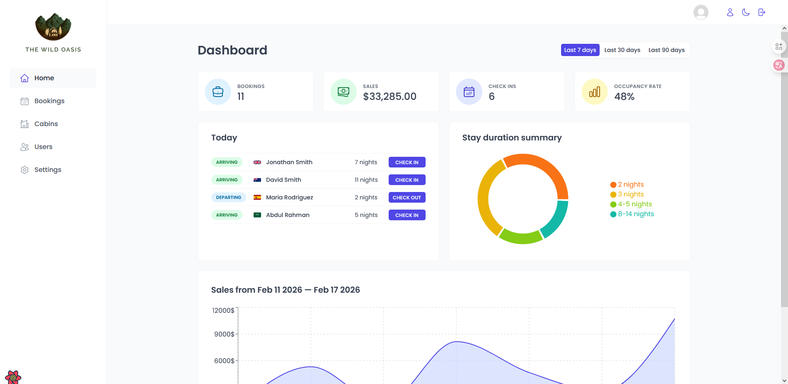
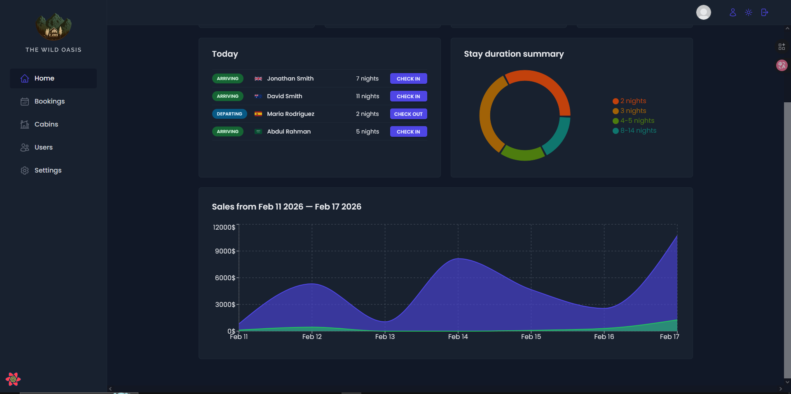

# Admin Dashboard (React.js | CRUD | Advanced State Management)

  
  

A modern, scalable admin panel for hotel management with full CRUD operations, advanced state management, and clean component architecture.

**Built with passion for performance, reusability, and developer experience.**

 

## ✨ Key Features

- **Full CRUD** functionality for rooms, bookings, users, and settings
- Advanced **state management** with React Query / TanStack Query
- **Protected routes** & role-based access control
- Real-time **loading states**, error handling, and toast notifications
- Beautiful UI with **dark mode** support
- Modular, feature-based folder structure for scalability
- Form handling with **React Hook Form**

## 🛠️ Tech Stack

| Category   | Technologies                                  |
| ---------- | --------------------------------------------- |
| Framework  | React 18, TypeScript                          |
| Build Tool | Vite                                          |
| Styling    | Tailwind CSS, Heroicons / Lucide icons        |
| State      | TanStack Query (React Query), Zustand / Redux |
| Forms      | React Hook Form                               |
| API        | RESTful endpoints with Supabase               |
| Other      | date-fns, react-hot-toast, clsx               |

## 📸 Screenshots

### Dashboard Overview

### Another View / Dashboard Two

> All screenshots are taken from the local development environment.

 

